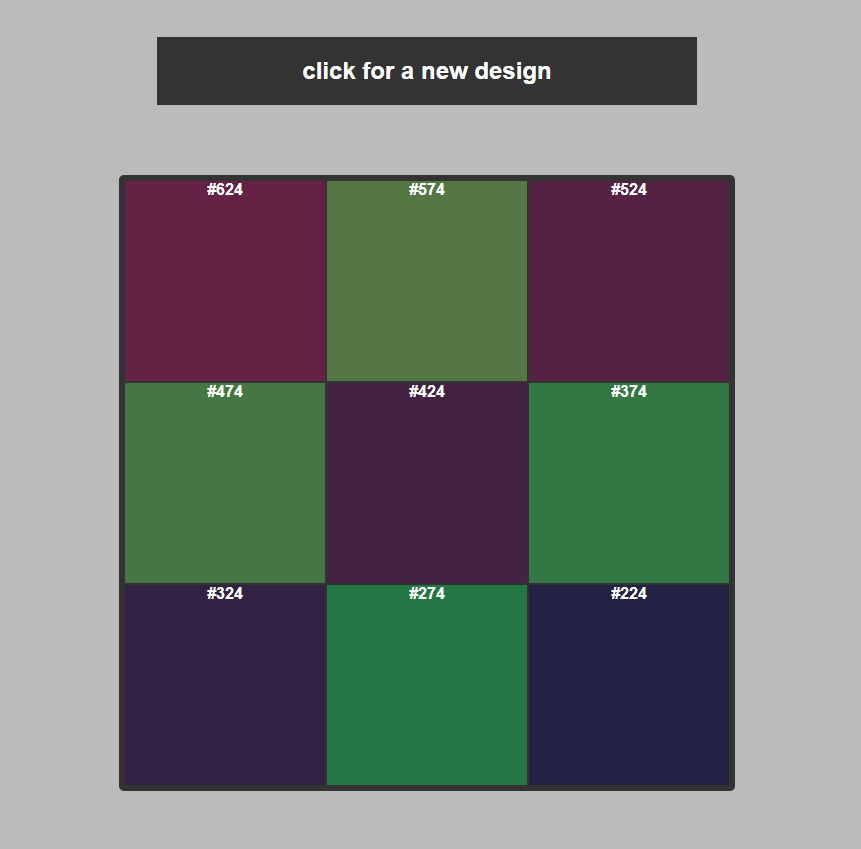

# colorsquare
A project to use a random color to create a grid of related color squares

This is my first iteration of some tools to help with quilt design.  I want to create a suite of fun coding project that help generate ideas for designs that I can then sew into quilting projects.

This first project is to satisfy a 'random quote generator' project for scrimba's Beginning JavaScript course.

Instead of a random quote, it selects a random color using RGB colors. The code loops through the squares and adds or subtracts from each of the RGB values. The colors are related, but can be more random if we 'wrap around' from 0 to 255.  Eventually, I'll iterate on this to select random fabrics, which are more limited in numbers. 

You can play with the webpage here https://steller-jay.github.io/colorsquare/

